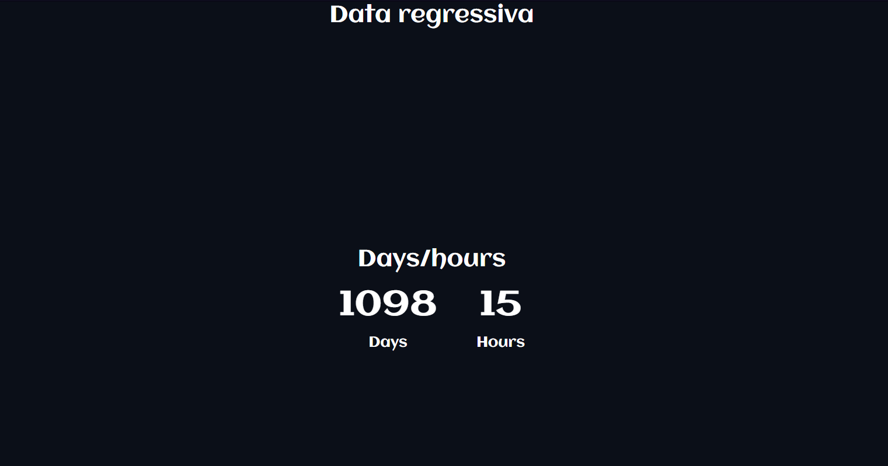

# Contador-Em-JS

Basta modificar: 
~~~js
 function makeTimer() {
    //		var endTime = new Date("29 April 2018 9:56:00 GMT+01:00");	exemplo
    var endTime = new Date("24 sep 2025 10:00:00 GMT+06:00"); //define a data do fim da contagem 
    endTime = (Date.parse(endTime) / 1000);

    var now = new Date();
    now = (Date.parse(now) / 1000);

    var timeLeft = endTime - now;

    var days = Math.floor(timeLeft / 86400);
    var hours = Math.floor((timeLeft - (days * 86400)) / 3600);

    if (hours < "10") {
      hours = "0" + hours;
    }

    $("#days").html(days + "Days");    //joga pro html
    $("#hours").html(hours + "Hours"); //joga pro html

  }
~~~

id: days & hour 
